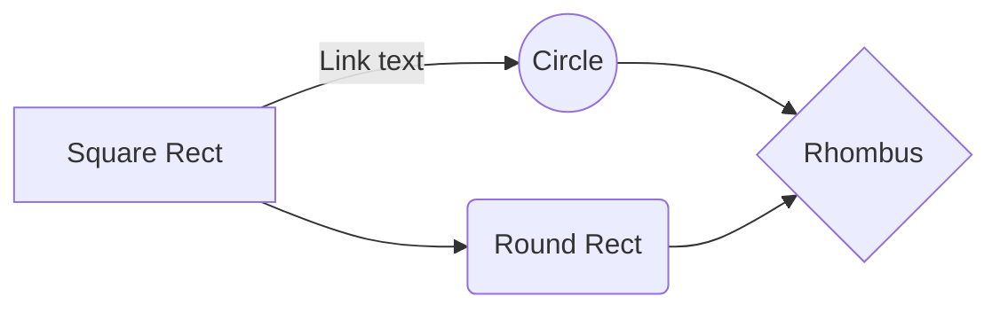
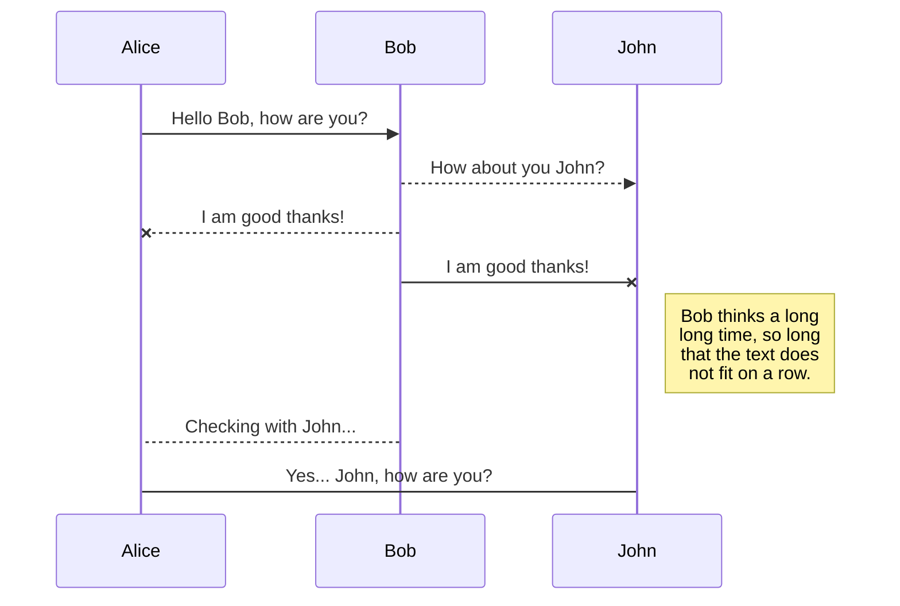

# Demo application

This is a demo application for [dropwizard-markdown-assets-bundle](https://github.com/rnorth/dropwizard-markdown-assets-bundle).

In real life this document could be used to describe what the application does, usage instructions, API docs etc.

This demo just shows a few features of the bundle:

> In the 'out of the box' configuration (with default template and stylesheet) the following additional features are supported:
> 
> * Fast, capable server-side markdown rendering using [flexmark-java](https://github.com/vsch/flexmark-java) (including Github Flavored Markdown):
>     * [Anchor links](https://github.com/vsch/flexmark-java/wiki/Extensions#anchorlink)
>     * [Autolink](https://github.com/vsch/flexmark-java/wiki/Extensions#autolink)
>     * [Footnotes](https://github.com/vsch/flexmark-java/wiki/Extensions#footnotes)
>     * [GFM Strikethrough](https://github.com/vsch/flexmark-java/wiki/Extensions#gfm-strikethrough)
>     * [GFM Task lists](https://github.com/vsch/flexmark-java/wiki/Extensions#gfm-tasklist)
>     * [GFM Tables](https://github.com/vsch/flexmark-java/wiki/Extensions#tables)
> * [Generated tables of contents](https://github.com/vsch/flexmark-java/wiki/Extensions#table-of-contents-1)
> * Optional rendering of diagrams using [Mermaid](https://knsv.github.io/mermaid/) in conjunction with fenced code blocks for graceful degradation:
>     * Graphs and flowcharts
>     * Sequence diagrams
>     * Gantt charts
> * Optional code syntax highlighting using [highlight.js](https://highlightjs.org/)
> * Optional analytics integration using Google Analytics
> * A simple and (subjectively!) nice default stylesheet
> * Ability to serve non-markdown static assets of any type, as well

... See [the Github project repo](https://github.com/rnorth/dropwizard-markdown-assets-bundle) for full documentation.

## Demo content

### General markdown

* See [Adam Pritchard's Markdown Cheatsheet](markdown-cheatsheet.md) rendered by this bundle.

### Diagrams

(Taken from https://knsv.github.io/mermaid/#demos)

#### Basic flowchart

The following markdown:

<pre lang="no-highlight"><code>```mermaid
graph LR
    A[Square Rect] -- Link text --> B((Circle))
    A --> C(Round Rect)
    B --> D{Rhombus}
    C --> D
```</code></pre>

Produces:



#### Larger flowchart with some styling

The following markdown:

<pre lang="no-highlight"><code>```mermaid
graph TB
    sq[Square shape] --> ci((Circle shape))

    subgraph A subgraph
        od>Odd shape]-- Two line<br>edge comment --> ro
        di{Diamond with <br/> line break} -.-> ro(Rounded<br>square<br>shape)
        di==>ro2(Rounded square shape)
    end

    %% Notice that no text in shape are added here instead that is appended further down
    e --> od3>Really long text with linebreak<br>in an Odd shape]

    %% Comments after double percent signs
    e((Inner / circle<br>and some odd <br>special characters)) --> f(,.?!+-*ز)

    cyr[Cyrillic]-->cyr2((Circle shape Начало));

     classDef green fill:#9f6,stroke:#333,stroke-width:2px;
     classDef orange fill:#f96,stroke:#333,stroke-width:4px;
     class sq,e green
     class di orange
```</code></pre>

Produces:


#### Basic sequence diagram

The following markdown:

<pre lang="no-highlight"><code>```mermaid
sequenceDiagram
    Alice ->> Bob: Hello Bob, how are you?
    Bob-->>John: How about you John?
    Bob--x Alice: I am good thanks!
    Bob-x John: I am good thanks!
    Note right of John: Bob thinks a long<br/>long time, so long<br/>that the text does<br/>not fit on a row.

    Bob-->Alice: Checking with John...
    Alice->John: Yes... John, how are you?
```</code></pre>

Produces:


