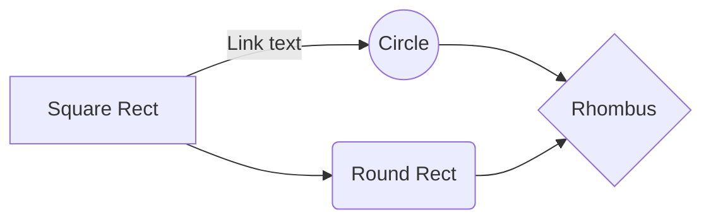
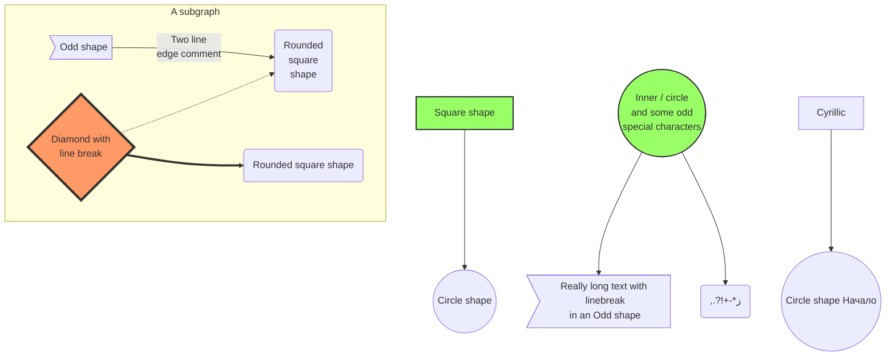
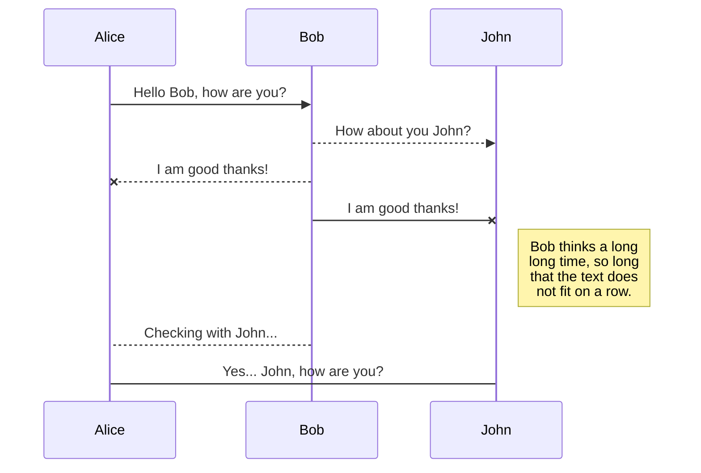

# Demo application

This is a demo application for [dropwizard-markdown-assets-bundle](https://github.com/rnorth/dropwizard-markdown-assets-bundle).

In real life this document could be used to describe what the application does, usage instructions, API docs etc.

For example, if your dropwizard service exposes API endpoints under `/api/...`, then adding this bundle would allow you to serve up documentation under `/docs/` (or any other paths of your choosing). This demo shows presentation of documentation without actually exposing any useful API endpoints.

This demo just shows a few features of the bundle:
* markdown formatting
* syntax highlighting
* diagrams support
* inline HTML and JS support

See [the Github project repo](https://github.com/rnorth/dropwizard-markdown-assets-bundle) for full documentation for the bundle.

The [Github repo for this demo](https://github.com/rnorth/dropwizard-markdown-assets-bundle-demo) shows how it can be used in practice.

## Demo content

### General markdown

Standard *markdown* **formatting** __features__ for text are supported. So are [links](#) and autolinks (such as http://example.org).

You can use:
* bulleted
* lists

And:
1. Numbered
2. Lists

> Blockquotes are supported

As are a few GFM extras:

* [x] Task
* [ ] Lists
* [ ] using `* [ ] syntax`

And Markdown tables:

| First Header  | Second Header |
| ------------- | ------------- |
| Content Cell  | Content Cell  |
| Content Cell  | Content Cell  |
| Content Cell  | Content Cell  |

* See [Adam Pritchard's Markdown Cheatsheet](markdown-cheatsheet.md) rendered by this bundle.

### Syntax highlighting

This is some example code showing syntax highlighting:

```java
public interface MarkdownBundleConfiguration {

    MarkdownAssetsConfiguration getMarkdownAssetsConfiguration();
}
```

### Diagrams

(Taken from https://knsv.github.io/mermaid/#demos)

#### Basic flowchart

The following markdown:

<pre lang="no-highlight"><code>```mermaid
graph LR
    A[Square Rect] -- Link text --> B((Circle))
    A --> C(Round Rect)
    B --> D{Rhombus}
    C --> D
```</code></pre>

Produces:



#### Larger flowchart with some styling

The following markdown:

<pre lang="no-highlight"><code>```mermaid
graph TB
    sq[Square shape] --> ci((Circle shape))

    subgraph A subgraph
        od>Odd shape]-- Two line<br>edge comment --> ro
        di{Diamond with <br/> line break} -.-> ro(Rounded<br>square<br>shape)
        di==>ro2(Rounded square shape)
    end

    %% Notice that no text in shape are added here instead that is appended further down
    e --> od3>Really long text with linebreak<br>in an Odd shape]

    %% Comments after double percent signs
    e((Inner / circle<br>and some odd <br>special characters)) --> f(,.?!+-*ز)

    cyr[Cyrillic]-->cyr2((Circle shape Начало));

     classDef green fill:#9f6,stroke:#333,stroke-width:2px;
     classDef orange fill:#f96,stroke:#333,stroke-width:4px;
     class sq,e green
     class di orange
```</code></pre>

Produces:



#### Basic sequence diagram

The following markdown:

<pre lang="no-highlight"><code>```mermaid
sequenceDiagram
    Alice ->> Bob: Hello Bob, how are you?
    Bob-->>John: How about you John?
    Bob--x Alice: I am good thanks!
    Bob-x John: I am good thanks!
    Note right of John: Bob thinks a long<br/>long time, so long<br/>that the text does<br/>not fit on a row.

    Bob-->Alice: Checking with John...
    Alice->John: Yes... John, how are you?
```</code></pre>

Produces:



### Inline HTML and JavaScript

Yes, inline HTML and JavaScript are supported! Use it responsibly.

Here's a `<div>`:

<div id="buttonTarget" style="border: 1px solid #cce; padding: 1em;">Press the button</div>

Here's a `<button>` with some associated inline JavaScript. A reference to a script file would also work, and is probably preferable:

<button id="trigger">Press me</button>

For reference the script content is:
```javascript
document.getElementById("trigger")
        .addEventListener("click", function() {
            document.getElementById("buttonTarget").innerHTML = "Button was pressed! It's " + new Date();
        });
```
<script>
document.getElementById("trigger")
        .addEventListener("click", function() {
            document.getElementById("buttonTarget").innerHTML = "Button was pressed! It's " + new Date();
        });
</script>